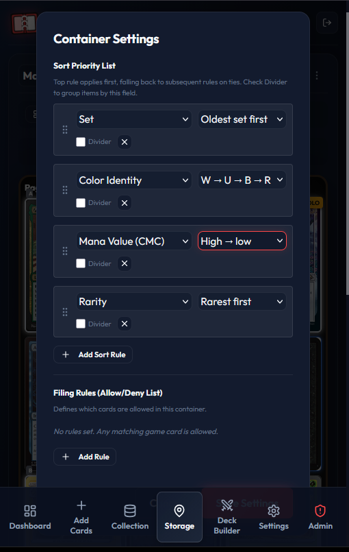

<div align="center">

# Bindarr

**Scan, value, organize, and locate your Pokémon & Magic: The Gathering cards — self-hosted.**

Identify physical cards with your phone's camera, track real-time market valuations, map every card to its binder/box slot, view rich analytics, and export your database for external trackers.

[](https://github.com/thenotoriousJeremy/bindarr/actions/workflows/docker-build.yml)
[](https://github.com/thenotoriousJeremy/bindarr/pkgs/container/bindarr)
[](LICENSE)
[](https://github.com/thenotoriousJeremy/bindarr/stargazers)
[](https://github.com/thenotoriousJeremy/bindarr/issues)
[](https://github.com/thenotoriousJeremy/bindarr/commits/main)

[Quick Start](#quick-start-development) · [Run with Docker](#docker-deployment-production) · [Features](#features) · [How Scanning Works](#card-scanning--match-data) · [Report a Bug](https://github.com/thenotoriousJeremy/bindarr/issues/new)

</div>

---

## Screenshots

<div align="center">
  
  
  
  <br/>
  
  
  
</div>

---

## Table of Contents

- [Features](#features)
- [ Tech Stack](#tech-stack)
- [ Run with Docker (fastest)](#docker-deployment-production)
- [ Quick Start (Development)](#quick-start-development)
- [ First-Time Sign In](#first-time-sign-in)
- [ Deck Checkout & Check-In](#deck-checkout--check-in)
- [ Card Scanning & Match Data](#card-scanning--match-data)
- [ Backup, Restore & Recovery](#backup-restore--recovery)
- [ Project Structure](#project-structure)
- [ License](#license)

---

## Features

- **Phone-Camera Image Identification**: Point your phone at a card and the server identifies it from the image — no typing. The pipeline auto-crops/deskews the card (OpenCV), recalls candidates with **CLIP** image embeddings, and confirms the exact card with **ORB** feature matching + RANSAC homography verification. Enter the **MTG set code** you're feeding and matching is scoped to that set (~300 cards) for exact-printing accuracy at one-tap speed. Works for both **Magic** (Scryfall) and **Pokémon** (Pokémon TCG API), with automatic game detection.
- **Confidence Gating & Manual Pick**: Every scan is gated on match confidence — ORB inlier count when geometric verification ran, otherwise CLIP cosine similarity. Above the gate the card auto-fills; below it the top candidates are shown for a one-tap manual pick.
- **Interactive Dashboard & Metrics**: Track total collection value, net worth trends (24H / 7D / 30D), average card value, holo print rates, energy type distributions (pie chart), rarity distributions, and set completion milestones.
- ** Real-world Location Coordinator**: Assign physical coordinate mappings to your cards so you can locate them instantly:
  - **Binders**: Maps by Binder Name, Page Number, and Slot (1-9). Features a double-page book view with 3D page-flip animations and multi-card slot stacking.
  - **Storage Boxes**: Maps by Box Name, Row ID/Letter, and Divider Section.
- **Deck Checkout & Check-In**: Reserve the physical cards for a deck and find them fast. Checking a deck out "for play" opens a locator that groups every card by **container → page → slot** and highlights each one in its compartment grid; while checked out, those cards are greyed and badged **In Play** in Storage. Checking the deck back in reverses the flow, guiding each card back to its slot. Select-all by page, container, or the whole deck.
- **Japanese Card Support**: Stores and displays cards under their native Japanese names (hiragana, katakana, kanji) and auto-translates them to English for API lookups.
- **Universal Database Exports**: One-click downloads of your complete database in CSV (TCGplayer format compatible) or JSON.
- **Multi-User Auth**: Session-token authentication (opaque random tokens stored in a server-side `sessions` table, sent as a `Bearer` header) with admin controls for managing users and roles.
- **100% Self-Hostable & Portable**: Single-container Docker build with a local SQLite database that mounts to a persistent volume.
- **CI/CD Automation**: GitHub Actions workflow to auto-build and publish the container image to GitHub Container Registry (GHCR).

---

##  Tech Stack

- **Frontend**: React, Vite, Recharts, Lucide React, Canvas Confetti
- **Backend**: Node.js, Express, SQLite (`sqlite3` module), Axios, Helmet, express-rate-limit
- **Card image ID**: `@huggingface/transformers` (CLIP embeddings via ONNX), `opencv-wasm` (ORB + homography), `sharp` (image processing)
- **Card data**: Pokémon TCG API (Pokémon), Scryfall (Magic)
- **Deployment**: Docker, Docker Compose, GitHub Actions

---

## Quick Start (Development)

### Prerequisites
- Node.js (v18+)
- npm (v9+)

### Installation
1. Clone this repository.
2. Install dependencies for the root, frontend, and backend packages:
   ```bash
   npm run install:all
   ```

### Running the App
Start both the React development server and the Express API server concurrently:
```bash
npm run dev
```
- **Frontend client**: `https://localhost:5173` (Runs over local HTTPS to allow camera access)
- **Backend API server**: `http://localhost:3001`

> [!IMPORTANT]
> **Mobile Camera HTTPS Requirement**: Modern mobile browsers (Safari, Chrome, Firefox) restrict video camera access (`getUserMedia`) to **Secure Contexts (HTTPS)** only. 
> 
> To test on your mobile phone:
> 1. Connect your phone and computer to the same Wi-Fi network.
> 2. Open **`https://<your-computer-ip>:5173`** in your mobile browser.
> 3. Your browser will display a warning because the local developer SSL certificate is self-signed. Tap **Advanced** (or *Show Details*) and select **Proceed/Trust** (e.g. *Proceed to 192.168.x.x (unsafe)*). The app will load, and the camera will initialize successfully!

#### Alternative: Chrome Developer Flags (HTTP)
If you prefer not to use self-signed HTTPS in development:
1. Open Google Chrome on your phone.
2. Navigate to `chrome://flags/#unsafely-treat-insecure-origin-as-secure`.
3. Enable the flag and enter your computer's IP: `http://<your-computer-ip>:5173` (and port `3001` for container testing).
4. Relaunch Chrome. The browser will treat this address as secure, allowing camera access.


---

## First-Time Sign In

On its **first startup**, Bindarr creates a default administrator account and prints the credentials to the server console (the terminal running `npm run dev` / `npm start`, or `docker-compose logs`).

Look for these lines in the startup logs:
```text
Created default admin user. ID: 1
  username: admin
  password: <generated-password>
Log in and change this password immediately via Settings.
```

- **Username**: `admin`
- **Password**:
  - If you set the `DEFAULT_ADMIN_PASSWORD` environment variable before first startup, that value is used.
  - Otherwise a random password is generated and printed **once** in the logs above. Copy it before clearing your terminal.

> [!IMPORTANT]
> The password is only printed on the run that creates the account (when the database is first initialized). If you miss it and did not set `DEFAULT_ADMIN_PASSWORD`, delete the SQLite database file so it is recreated on the next startup, or set `DEFAULT_ADMIN_PASSWORD` and recreate the database.

After logging in, open **Settings** and change the password. Additional users can self-register from the login screen (they are created with the `member` role); an `admin` can manage users and roles from the **Admin** panel.

---

## Deck Checkout & Check-In

Decks let you reserve the physical cards you need for a game and locate them fast. Checkout and check-in **never move your cards** in the database — a card's stored slot is both where you grab it and where it returns. The only thing that changes is the deck's checked-out status, which drives the greying in Storage.

### Checking out (grab cards for play)
1. Open the **Decks** tab, select a deck, and click **Checkout**.
2. The app verifies you own enough copies (copies already committed to other checked-out decks are excluded). If you're short, it lists what's missing and stops.
3. A **locator** opens, grouped by where each card lives:
   - **Container → Page** (e.g. `binder → Page 5`). Each located page renders its compartment grid with the cards you need highlighted in green.
   - **Unassigned Pile** for cards not yet filed into a container (no grid).
4. Tick each card as you pull it. Progress shows `N of M pulled`. Use **Select all** at the page, container, or whole-deck level to check off groups at once.

While a deck is checked out, its cards show **greyed with an "In Play" badge** in the Storage view, so you can see which slots are empty at a glance. If you pull only some copies of a stack, the badge reads `1/2 Out`.

### Checking in (put cards back)
1. Click **Return** on a checked-out deck.
2. The same locator opens in reverse — **Return to Storage** — showing where each card goes back (container → page → slot, highlighted in the grid).
3. Tick cards as you re-file them; the same select-all controls apply.

---

## Docker Deployment (Production)

Bindarr ships as a single container (multi-stage build, serves the compiled frontend from the Node server) published to GitHub Container Registry. **No clone or build needed** — copy the compose file below and run.

### Run with the prebuilt image (copy-paste)

1. Create a `docker-compose.yml`:
   ```yaml
   services:
     bindarr:
       image: ghcr.io/thenotoriousjeremy/bindarr:latest
       container_name: bindarr
       restart: unless-stopped
       ports:
         - "3001:3001"
       environment:
         # All optional. Uncomment and set as needed.
         # - POKEMON_TCG_API_KEY=        # free key from pokemontcg.io raises rate limits
         # - PUBLIC_BASE_URL=            # external URL behind a proxy, e.g. https://cards.example.com. Share links + auto-allowed as a CORS origin (proxied logins work with just this)
         # - DEFAULT_ADMIN_PASSWORD=     # pin the initial admin password (else it's auto-generated in the logs)
         # - ALLOW_REGISTRATION=         # "true" to allow open self-registration; default is invite-only
         # - TRUST_PROXY=                # "1" when behind a TLS-terminating reverse proxy
       volumes:
         - bindarr-data:/app/database

   volumes:
     bindarr-data:
   ```

2. Start it:
   ```bash
   docker compose up -d
   ```

3. Open `http://localhost:3001`. Grab the auto-generated admin password from the logs (`docker compose logs | grep password`) — see [First-Time Sign In](#first-time-sign-in). All data persists in the `bindarr-data` volume.

> [!TIP]
> Update to the newest image any time with `docker compose pull && docker compose up -d`. Your data in the volume is untouched.

### Building from source instead

Prefer to build locally? Clone the repo — its [`docker-compose.yml`](docker-compose.yml) uses `build:` instead of `image:` — then run `docker compose up -d`.

### Environment variables (`.env`)
You can configure Bindarr by passing these environment variables in your container configuration:
- `PORT` (Default: `3001`) - The port the server runs on.
- `DB_PATH` (Default: `/app/database/pokemon_cards.db`) - Location of the SQLite database.
- `POKEMON_TCG_API_KEY` (Optional) - Your API key from [pokemontcg.io](https://pokemontcg.io). While Bindarr works without one, adding a free key increases TCG API rate limits (from 20k to 50k requests/day).
- `DEFAULT_ADMIN_PASSWORD` (Optional) - Sets a known password for the auto-created `admin` account on first startup. If unset, a random password is generated and printed once to the server logs (see [First-Time Sign In](#first-time-sign-in)).
- `PUBLIC_BASE_URL` (Optional) - Externally-reachable URL when running behind a reverse proxy, e.g. `https://cards.example.com`. Used to build collection share links, and its origin is automatically added to the CORS allow-list, so setting this alone is enough for logins through the proxy. Also editable from the Admin panel. (`localhost` and private-LAN origins are always allowed regardless. To whitelist *additional* public origins, set `CORS_ORIGIN` to a comma-separated list.)
- `ALLOW_REGISTRATION` (Optional) - Set to `true` to allow open self-registration from the login screen. Default (unset) is **invite-only**: only an admin creates accounts via the Admin panel, and the Sign Up option is hidden.
- `TRUST_PROXY` (Optional) - Set to the number of proxy hops (usually `1`) when running behind a reverse proxy that terminates TLS, so `req.ip` and the rate limiters use the real client IP from `X-Forwarded-For`. Leave unset when the app is directly exposed. Note: mobile camera access requires HTTPS, so a TLS-terminating proxy in front of the app is the expected production setup.

### Health check
The server exposes `GET /api/health` (no auth). It returns `200 {"status":"ok"}` when the app and database are reachable, `503` otherwise. The Docker image already wires this into a `HEALTHCHECK`.

---

## Card Scanning & Match Data

Identification is **image-only** — your photo is matched against precomputed visual features, no OCR. Reference data lives in `backend/data/` (gitignored — large and regenerable; not shipped in the repo).

### How identification works

Every scan runs the same pipeline server-side (`backend/src/scanMatch.js`):

1. **Detect & rectify the card.** OpenCV (`opencv-wasm`) runs Canny edge detection + contour analysis on the frame and scores candidate regions by `size × card-aspect-fit × centrality` (a whole card is a ~0.71 portrait rectangle, which rejects internal blocks like the art window or type line). The winner is either perspective-warped flat from a clean 4-point quad (removes tilt/skew) or cropped from its bounding box. If nothing card-like is found, it falls back to a centered crop of the on-screen guide box.
2. **Recall (CLIP).** The rectified image is embedded with a **CLIP** model (`@huggingface/transformers`, ONNX) and compared by cosine similarity against the embedding database to pull the ~250 visually-nearest candidates. This narrows tens of thousands of cards to a shortlist fast, but similar-looking cards/printings can rank close.
3. **Verify (ORB + homography).** For each candidate, **ORB** binary descriptors are matched to the query with a brute-force Hamming matcher and Lowe's ratio test (0.75), then a **RANSAC homography** (5px reprojection threshold) is fit between the matched keypoints. The number of geometric **inliers** is the decisive score: only the true printing produces many spatially-consistent matches, so ranking by inliers resolves the exact card rather than a look-alike. If a game's ORB DB isn't built, it ranks on CLIP similarity alone.
4. **Game auto-detection.** It verifies the game you're scanning in first; if the best match is weak (< 25 inliers) it also runs the other game and keeps whichever scores higher, so scanning in the wrong mode still works.
5. **Confidence gate (client).** The top result auto-fills when it clears the gate (≥ 12 ORB inliers, or ≥ 0.55 CLIP cosine similarity when ORB didn't run); below that, the candidate list is shown for a one-tap manual pick.

There are two ways to supply the reference features:

**Set-scoped MTG (recommended, no pre-build).** Enter the set code of the box you're scanning. The first scan of a new set builds that set's ORB index on demand from Scryfall (~1 min, cached under `backend/data/sets/`); every subsequent scan matches within just that set (ORB inliers against every printing, no global CLIP recall needed) for exact-printing accuracy. Nothing to run ahead of time.

**Global / code-free matching (optional, heavy pre-build).** To identify cards without giving a set code (and to power game auto-detection), precompute the full CLIP embedding + ORB databases:

```bash
cd backend
# CLIP embeddings (recall) — per game
node --max-old-space-size=2048 scripts/build-card-embeddings.mjs --game mtg
node --max-old-space-size=2048 scripts/build-card-embeddings.mjs --game pokemon
# ORB features (geometric verification) — per game
node scripts/build-card-orb.mjs --game mtg
node scripts/build-card-orb.mjs --game pokemon
```

These download every card image and are **heavy**: several hours of CPU + downloads and ~1.6 GB on disk. Both scripts checkpoint and support `--resume`. A `POKEMON_TCG_API_KEY` (see below) is recommended for the Pokémon build. Without these DBs, set-scoped MTG matching still works (it builds on demand); only code-free matching and game auto-detection need the pre-built data.

> [!NOTE]
> The endpoints backing this are `POST /api/scan-match` (identify an uploaded card image) and `POST /api/prepare-set` (build/verify a set's index). The backend has no auto-reload — restart it after changing backend code so new routes/data load.

---

## Backup, Restore & Recovery

**Backup.** All state lives in the single SQLite file (the `bindarr-data` volume in Docker, or `DB_PATH` locally). Two options:
- **File-level:** copy the DB file while the container is stopped, e.g. `docker run --rm -v bindarr-data:/data -v "$PWD":/backup alpine cp /data/pokemon_cards.db /backup/`. (The app runs in WAL mode; stop the container first so the `-wal`/`-shm` files are checkpointed.)
- **Per-user data:** each user can also export their own collection from the app as CSV or JSON (Collection → Export). This is portable to other trackers but does not include other users or app settings.

**Restore.** Stop the container, drop the backed-up `pokemon_cards.db` into the volume, start again. Or use the in-app Import (CSV/JSON) to restore a single user's collection.

**Lost admin password.** The initial `admin` password is printed once, on the run that first creates the database. If you lose it and did not set `DEFAULT_ADMIN_PASSWORD`, either set that variable and recreate the database, or delete the DB file so a fresh admin is generated on next startup. There is no self-service password reset.

---

## Project Structure

```text
/bindarr
  ├── backend/
  │     ├── src/
  │     │     ├── db.js              # SQLite schema, migrations & DB connection
  │     │     ├── server.js          # Express app: middleware, routes, /api/health
  │     │     ├── tcgApi.js          # Pokémon TCG API proxy, cache & price updates
  │     │     ├── scryfallApi.js     # Scryfall (Magic) proxy, cache & price updates
  │     │     ├── embedMatch.js      # CLIP embedding recall (image -> candidate cards)
  │     │     ├── scanMatch.js       # Auto-crop/deskew + CLIP recall + ORB verify orchestration
  │     │     ├── setIndex.js        # Lazy per-set ORB index for set-scoped matching
  │     │     ├── middleware/
  │     │     │     └── auth.js       # Session-token auth, admin guard, rate limiters
  │     │     ├── routes/            # auth, admin, collection (+scan-match/prepare-set), sets, decks, shared
  │     │     └── utils/             # compartmentSort (filing engine), priceHelpers, authHelpers
  │     ├── scripts/                 # build-card-embeddings.mjs, build-card-orb.mjs, cardSources.js
  │     ├── data/                    # Precomputed embeddings/ORB/per-set indexes (gitignored)
  │     ├── test/                    # Framework-free tests: unit + e2e/ runner (npm test)
  │     └── package.json
  ├── frontend/
  │     ├── src/
  │     │     ├── components/        # Dashboard, CameraScanner, CardSearch, LocationManager,
  │     │     │                      #   CollectionList, AdminPanel, Settings, DeckBuilder,
  │     │     │                      #   SharedCollection, PriceHistoryChart, CardInspectorModal
  │     │     ├── utils/             # sorting, pricing, translation & printing helpers
  │     │     ├── App.jsx            # Routing tab controller + fetch/auth interceptor
  │     │     ├── index.css          # Core premium dark styling
  │     │     └── main.jsx
  │     ├── .eslintrc.cjs
  │     ├── package.json
  │     └── vite.config.js
  ├── Dockerfile                     # Multi-stage build, runs as non-root, HEALTHCHECK
  ├── docker-compose.yml
  ├── .dockerignore
  └── .github/
        └── workflows/
              └── docker-build.yml   # verify (backend tests) -> build & push to GHCR
```

---

## License

Released under the [MIT License](LICENSE).
